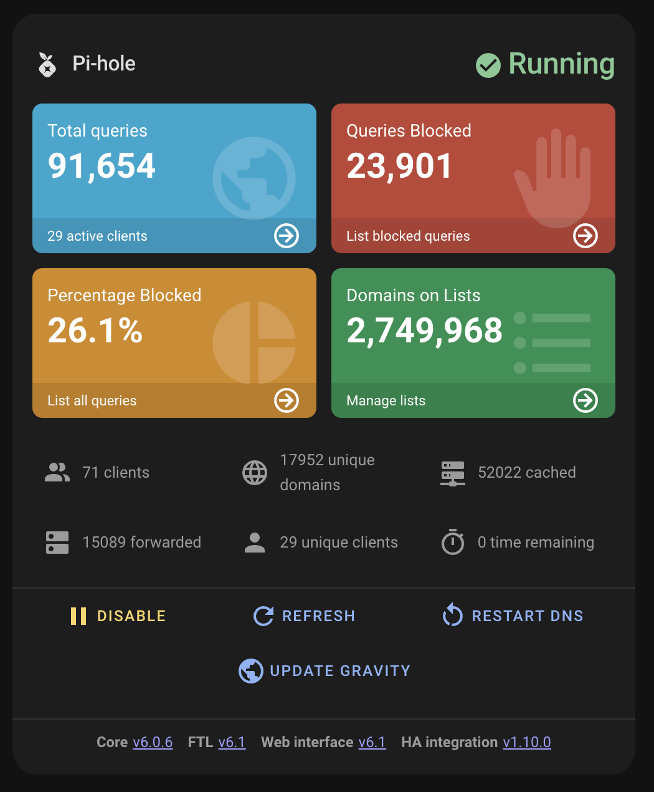
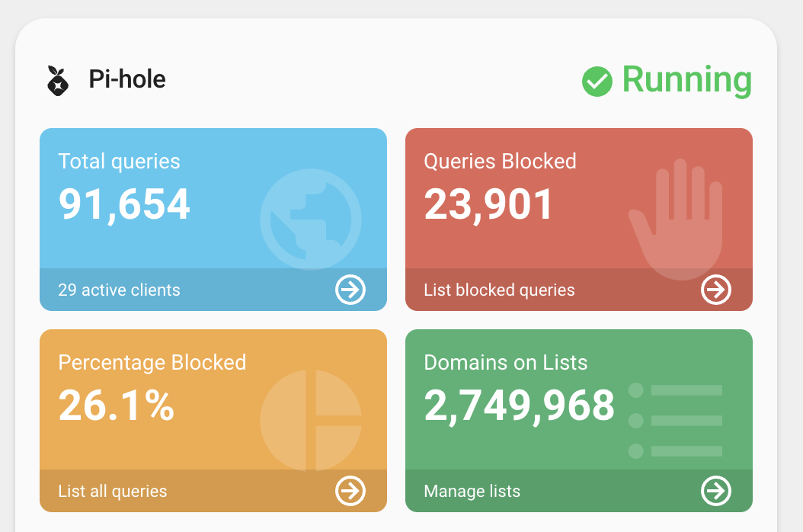
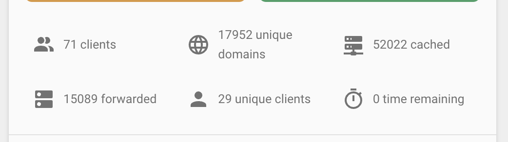
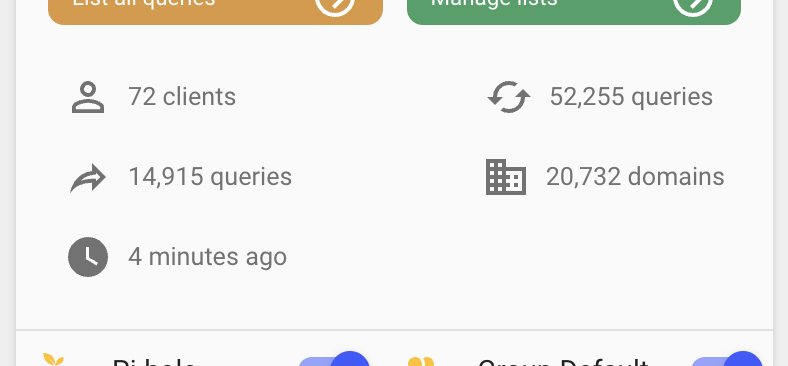
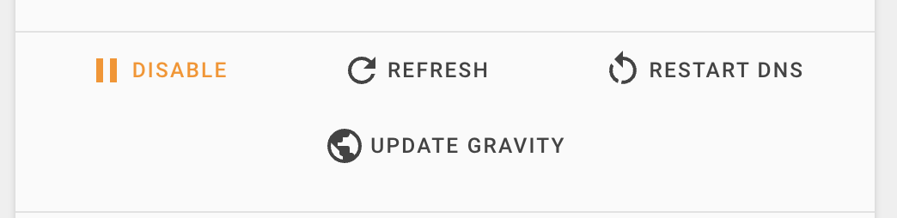
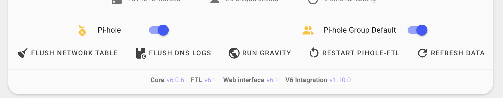
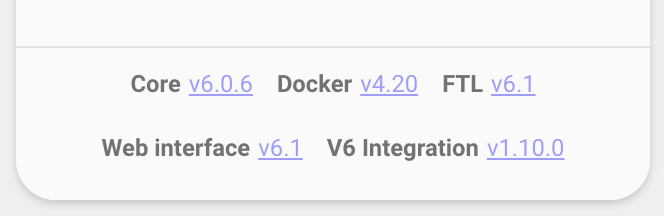
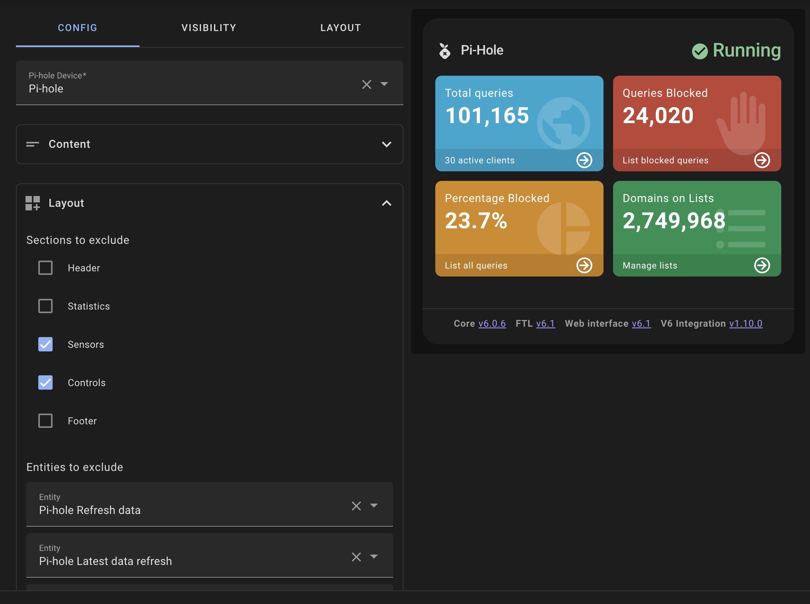
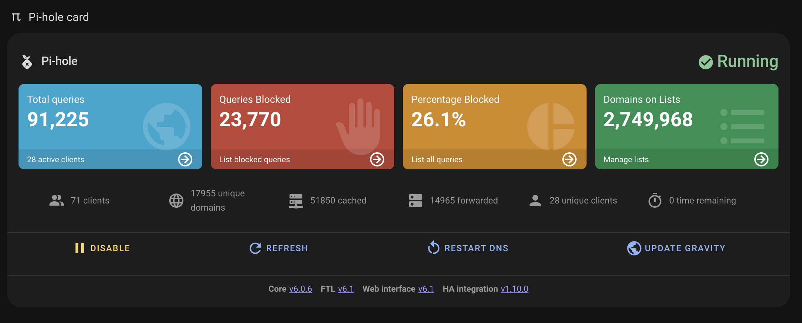
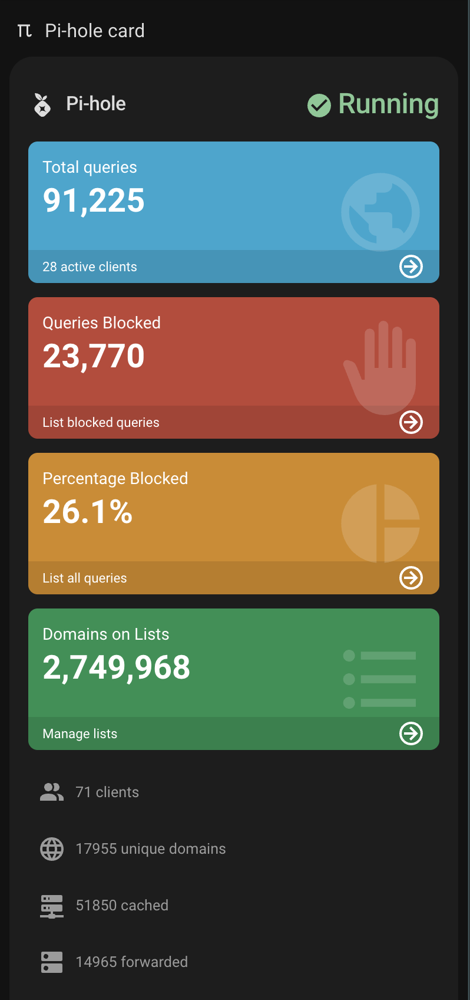

# Pi-hole Card

<p align="center">
    
</p>
<p align="center"><h1 align="center">Pi-hole Card</h1></p>
<p align="center">
	<em>Complete Pi-hole monitoring and control for Home Assistant</em>
</p>


[](https://github.com/hacs/integration)


<p align="center">Built with the tools and technologies:</p>
<p align="center">
	
	
	
	
	
</p>
<br>

## Overview

A comprehensive dashboard card for managing and monitoring your Pi-hole DNS ad blocker directly from Home Assistant. The card provides real-time statistics and controls in an intuitive, dashboard-style interface that matches the Pi-hole visual identity.

## Features

### Dashboard Statistics

- **Main Statistics Dashboard** - Four color-coded tiles showing your most important Pi-hole metrics:
  - Total DNS Queries
  - Queries Blocked
  - Block Percentage
  - Domains on Blocklists



### Additional Metrics

- **Client Statistics** - See active clients, unique domains, unique clients, etc.
- **Performance Data** - View cached queries and forwarded DNS requests
- **Interactive Elements** - Configurable tap, hold, and double-tap actions for all metrics





### Direct Controls

- **Enable/Disable Controls** - Toggle Pi-hole filtering with a single click as well as Group Default
- **Action Buttons** - Quick access buttons for common maintenance tasks:
  - Restart DNS
  - Update Gravity
  - Flush ARP
  - Flush Logs
- **Customizable Actions** - Configure custom actions for the control buttons in this section





### Version Information

- **Component Versions** - Display installed versions for all Pi-hole components:
  - Core
  - Docker
  - FTL
  - Web Interface
  - Home Assistant Integration
  - Last Refresh Time



### Status Monitoring

- **Real-time Status** - Visual indication of Pi-hole's current state
- **Error Detection** - Automatic highlighting when issues are detected
- **Update Indicators** - Clear notification when updates are available
- **Block Time Remaining** - Shows how much time remaining until blocking enables


### Interactive Dashboard

- **Clickable Elements** - All sections can be configured with custom actions
- **Visual Indicators** - Color-coded statistics to understand status at a glance
- **Customizable Card** - Set custom title and icon to match your dashboard style
- **Entity Filtering** - Ability to exclude specific entities or entire sections



### Responsive Design

- **Mobile-friendly** - Optimized layout for both desktop and mobile viewing
- **Fluid Layout** - Responsive design adapts to available space




## Installation

### Prerequisites

> [!WARNING]  
> Before using this card, please ensure you have the [Pi-hole v6 integration](https://github.com/bastgau/ha-pi-hole-v6) installed in your Home Assistant instance.

### HACS (Recommended)

[](https://my.home-assistant.io/redirect/hacs_repository/?owner=homeassistant-extras&repository=pi-hole-card&category=dashboard)

1. Open HACS in your Home Assistant instance
2. Click the menu icon in the top right and select "Custom repositories"
3. Add this repository URL and select "Dashboard" as the category
   - `https://github.com/homeassistant-extras/pi-hole-card`
4. Click "Install"

### Manual Installation

1. Download the `pi-hole-card.js` file from the latest release in the Releases tab.
2. Copy it to your `www/community/pi-hole-card/` folder
3. Add the following to your `configuration.yaml` (or add as a resource in dashboards menu)

```yaml
lovelace:
  resources:
    - url: /local/community/pi-hole-card/pi-hole-card.js
      type: module
```

## Usage

Add the card to your dashboard using the UI editor or YAML:

### Card Editor

The card is fully configurable through the card editor, allowing you to customize:

- Pi-hole device selection
- Card title and icon
- Custom actions for statistics, info panels, and control buttons


### YAML

This is the most minimal configuration needed to get started:

```yaml
type: custom:pi-hole
device_id: your_pihole_device_id
```

The card will automatically:

- Detect all Pi-hole entities associated with the device
- Organize statistics in the dashboard layout
- Display control buttons for common actions
- Show version information for all components

## Configuration Options

| Name             | Type   | Default      | Description                                     |
| ---------------- | ------ | ------------ | ----------------------------------------------- |
| device_id        | string | **Required** | The ID of your Pi-hole device in Home Assistant |
| title            | string | Pi-Hole      | Custom title for the card header                |
| icon             | string | mdi:pi-hole  | Custom icon for the card header                 |
| stats            | object | _none_       | Configure actions for statistics tiles          |
| info             | object | _none_       | Configure actions for additional info items     |
| controls         | object | _none_       | Configure actions for control buttons           |
| exclude_sections | list   | _none_       | Sections of entities to exclude. See below.     |
| exclude_entities | list   | _none_       | Entities to remove from the card.               |

### Action Configuration

Each section (stats, info, controls) supports the following action types:

| Name              | Type   | Default    | Description                          |
| ----------------- | ------ | ---------- | ------------------------------------ |
| tap_action        | object | _optional_ | Action to perform when tapped        |
| hold_action       | object | _optional_ | Action to perform when held          |
| double_tap_action | object | _optional_ | Action to perform when double-tapped |

Actions can be configured to perform various operations such as:

- Toggle entities
- Show more info
- Call services
- Navigate to different views
- And more!

### Section Options

The following section names can be used with `exclude_sections`:

- header
- statistics
- sensors
- controls
- footer

### Auto-discovery

The card automatically discovers and identifies all Pi-hole entities based on:

- Entity naming patterns
- Translation keys
- Entity relationships to the device

This includes sensors, buttons, switches, binary sensors, and update entities.

## Example Configurations

### Basic Configuration

```yaml
type: custom:pi-hole
device_id: pi_hole_device_1
```

### With Custom Title and Icon

```yaml
type: custom:pi-hole
device_id: pi_hole_device_1
title: 'My Pi-hole Server'
icon: 'mdi:shield-check'
```

#### Excluding Sections & Entities

```yaml
type: custom:pi-hole
device_id: pi_hole_device_1
exclude_sections:
  - sensors
  - controls
exclude_entities:
  - button.pi_hole_action_refresh_data
  - sensor.pi_hole_latest_data_refresh
```

### With Custom Actions

```yaml
type: custom:pi-hole
device_id: pi_hole_device_1
title: 'Network Protection'
stats:
  tap_action:
    action: more-info
  hold_action:
    action: navigate
    navigation_path: /lovelace/network
controls:
  tap_action:
    action: toggle
  hold_action:
    action: more-info
```

### Custom Actions for All Sections

```yaml
type: custom:pi-hole
device_id: pi_hole_device_1
# Configure stat box actions
stats:
  tap_action:
    action: call-service
    perform_action: browser_mod.popup
    data:
      title: Pi-hole Statistics
      content: 'Detailed view of Pi-hole stats'
  hold_action:
    action: navigate
    navigation_path: /lovelace/network-monitoring
# Configure additional info actions
info:
  tap_action:
    action: more-info
  double_tap_action:
    action: toggle
# Configure control button actions
controls:
  tap_action:
    action: toggle
  hold_action:
    action: more-info
  double_tap_action:
    action: call-service
    perform_action: browser_mod.popup
    data:
      title: Pi-hole Controls
      content: 'Advanced Pi-hole control panel'
```

## Project Roadmap

- [x] **`Initial design`**: create initial card design
- [x] **`Auto-discovery`**: automatic detection of Pi-hole entities
- [x] **`Dashboard statistics`**: visual representation of key metrics
- [x] **`Control buttons`**: quick actions for common Pi-hole tasks
- [x] **`Version info`**: display component versions
- [x] **`Custom actions`**: tap/hold/double-tap actions for all elements
- [x] **`Card customization`**: custom title and icon options
- [x] **`Performance optimizations`**: improved code structure and efficiency
- [x] **`Enhanced entity mapping`**: better entity identification with translation keys
- [x] **`Translations`**: ability to add translations
- [ ] **`Links directly to sub pages`**: direct links to specific Pi-hole admin pages
- [ ] **`Additional visualization options`**: more chart types for displaying statistics

## Contributing

- **💬 [Join the Discussions](https://github.com/homeassistant-extras/pi-hole-card/discussions)**: Share your insights, provide feedback, or ask questions.
- **🐛 [Report Issues](https://github.com/homeassistant-extras/pi-hole-card/issues)**: Submit bugs found or log feature requests for the `pi-hole` project.
- **💡 [Submit Pull Requests](https://github.com/homeassistant-extras/pi-hole-card/blob/main/CONTRIBUTING.md)**: Review open PRs, and submit your own PRs.
- **📣 [Check out discord](https://discord.gg/NpH4Pt8Jmr)**: Need further help, have ideas, want to chat?
- **🃏 [Check out my other cards!](https://github.com/orgs/homeassistant-extras/repositories)** Maybe you have an integration that I made cards for.

<details closed>
<summary>Contributing Guidelines</summary>

1. **Fork the Repository**: Start by forking the project repository to your GitHub account.
2. **Clone Locally**: Clone the forked repository to your local machine using a git client.
   ```sh
   git clone https://github.com/homeassistant-extras/pi-hole-card
   ```
3. **Create a New Branch**: Always work on a new branch, giving it a descriptive name.
   ```sh
   git checkout -b new-feature-x
   ```
4. **Make Your Changes**: Develop and test your changes locally.
5. **Commit Your Changes**: Commit with a clear message describing your updates.
   ```sh
   git commit -m 'Implemented new feature x.'
   ```
6. **Push to GitHub**: Push the changes to your forked repository.
   ```sh
   git push origin new-feature-x
   ```
7. **Submit a Pull Request**: Create a PR against the original project repository. Clearly describe the changes and their motivations.
8. **Review**: Once your PR is reviewed and approved, it will be merged into the main branch. Congratulations on your contribution!
</details>

## Translations

The Pi-hole card supports multiple languages to provide a better experience for users worldwide.

### Currently supported languages:

- English

Want to contribute a translation? See our [translation guide](TRANSLATIONS.md) for instructions.

## License

This project is protected under the MIT License. For more details, refer to the [LICENSE](LICENSE) file.

## Acknowledgments

- Built using [LitElement](https://lit.dev/)
- Inspired by Pi-hole's own dashboard design
- Thanks to all contributors!

[](https://github.com/homeassistant-extras/pi-hole-card/graphs/contributors)

[](https://ko-fi.com/N4N71AQZQG)

## Code Quality

Stats

[](https://sonarcloud.io/summary/new_code?id=homeassistant-extras_pi-hole-card)
[](https://sonarcloud.io/summary/new_code?id=homeassistant-extras_pi-hole-card)
[](https://sonarcloud.io/summary/new_code?id=homeassistant-extras_pi-hole-card)
[](https://sonarcloud.io/summary/new_code?id=homeassistant-extras_pi-hole-card)
[](https://sonarcloud.io/summary/new_code?id=homeassistant-extras_pi-hole-card)
[](https://sonarcloud.io/summary/new_code?id=homeassistant-extras_pi-hole-card)
[](https://sonarcloud.io/summary/new_code?id=homeassistant-extras_pi-hole-card)

Ratings

[](https://sonarcloud.io/summary/new_code?id=homeassistant-extras_pi-hole-card)
[](https://sonarcloud.io/summary/new_code?id=homeassistant-extras_pi-hole-card)
[](https://sonarcloud.io/summary/new_code?id=homeassistant-extras_pi-hole-card)
[](https://sonarcloud.io/summary/new_code?id=homeassistant-extras_pi-hole-card)

## Build Status

### Main

[](https://github.com/homeassistant-extras/pi-hole-card/actions/workflows/push.yml)
[](https://github.com/homeassistant-extras/pi-hole-card/actions/workflows/pull_request.yaml)

### Release

[](https://github.com/homeassistant-extras/pi-hole-card/actions/workflows/push.yml)
[](https://github.com/homeassistant-extras/pi-hole-card/actions/workflows/merge.yaml)
