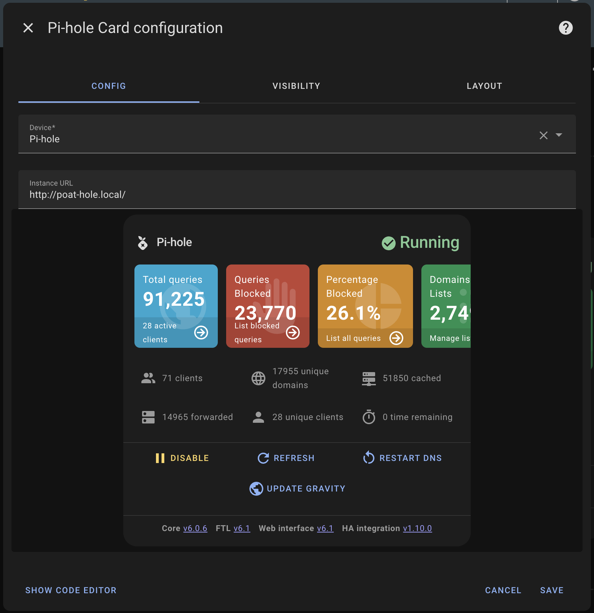

<p align="center">
    
</p>
<p align="center"><h1 align="center">Room Summary Card</h1></p>
<p align="center">
	<em>Room Data at Your Fingertips</em>
</p>


[](https://github.com/hacs/integration)


<p align="center">Built with the tools and technologies:</p>
<p align="center">
	
	
	
	
	
</p>
<br>

## Overview

A custom card for Home Assistant that provides a comprehensive room overview, including climate information, device states, and problem indicators. The card displays room temperature, humidity, connected devices, and entity states in an organized grid layout.

## Features


## Installation

### HACS (Recommended)

[](https://my.home-assistant.io/redirect/hacs_repository/?owner=homeassistant-extras&repository=REPLACE-ME&category=dashboard)

1. Open HACS in your Home Assistant instance
2. Click the menu icon in the top right and select "Custom repositories"
3. Add this repository URL and select "Dashboard" as the category
   - `https://github.com/homeassistant-extras/REPLACE-ME`
4. Click "Install"

### Manual Installation

1. Download the `REPLACE-ME.js` file from the latest release in the Releases tab.
2. Copy it to your `www/community/REPLACE-ME/` folder
3. Add the following to your `configuration.yaml` (or add as a resource in dashboards menu)

```yaml
lovelace:
  resources:
    - url: /local/community/REPLACE-ME/REPLACE-ME.js
      type: module
```

## Usage


Add the card to your dashboard using the UI editor or YAML:

### Card Editor

Slowly I'm enabling all the features in the card editor. Note that as things get converted to there some yaml settings may move / rename.



### YAML

This is the most minimal configuarion needed to get started. See below for advanced usage.

```yaml
type: custom:REPLACE-ME
area: living_room
```

The card will automatically:


## Example Configurations

### Basic Configuration

```yaml
type: custom:REPLACE-ME
area: living_room
```

### Full Configuration

```yaml
type: custom:REPLACE-ME
area: living_room
...
```

For examples, see my HA configuration for my dashboard home page: [01-home.yaml](https://github.com/warmfire540/home-assistant-config-public/blob/home/ui_lovelace_minimalist/dashboard/views/01-home.yaml)


## Project Roadmap

- [x] **`Initial design`**: create initial card design

## Contributing

- **💬 [Join the Discussions](https://github.com/homeassistant-extras/REPLACE-ME/discussions)**: Share your insights, provide feedback, or ask questions.
- **🐛 [Report Issues](https://github.com/homeassistant-extras/REPLACE-ME/issues)**: Submit bugs found or log feature requests for the `REPLACE-ME` project.
- **💡 [Submit Pull Requests](https://github.com/homeassistant-extras/REPLACE-ME/blob/main/CONTRIBUTING.md)**: Review open PRs, and submit your own PRs.
- **📣 [Check out discord](https://discord.gg/F28wupKC)**: Need further help, have ideas, want to chat?

<details closed>
<summary>Contributing Guidelines</summary>

1. **Fork the Repository**: Start by forking the project repository to your github account.
2. **Clone Locally**: Clone the forked repository to your local machine using a git client.
   ```sh
   git clone https://github.com/homeassistant-extras/REPLACE-ME
   ```
3. **Create a New Branch**: Always work on a new branch, giving it a descriptive name.
   ```sh
   git checkout -b new-feature-x
   ```
4. **Make Your Changes**: Develop and test your changes locally.
5. **Commit Your Changes**: Commit with a clear message describing your updates.
   ```sh
   git commit -m 'Implemented new feature x.'
   ```
6. **Push to github**: Push the changes to your forked repository.
   ```sh
   git push origin new-feature-x
   ```
7. **Submit a Pull Request**: Create a PR against the original project repository. Clearly describe the changes and their motivations.
8. **Review**: Once your PR is reviewed and approved, it will be merged into the main branch. Congratulations on your contribution!
</details>

## License

This project is protected under the MIT License. For more details, refer to the [LICENSE](LICENSE) file.

## Acknowledgments

- Built using [LitElement](https://lit.dev/)
- Inspired by Home Assistant's chip design
- Button-Card was a huge inspo
- Thanks to all contributors!

[](https://github.com{/homeassistant-extras/REPLACE-ME/}graphs/contributors)

[](https://ko-fi.com/N4N71AQZQG)

## Code Quality

Forgive me and my badges..

Stats

[](https://sonarcloud.io/summary/new_code?id=homeassistant-extras_REPLACE-ME)
[](https://sonarcloud.io/summary/new_code?id=homeassistant-extras_REPLACE-ME)
[](https://sonarcloud.io/summary/new_code?id=homeassistant-extras_REPLACE-ME)
[](https://sonarcloud.io/summary/new_code?id=homeassistant-extras_REPLACE-ME)
[](https://sonarcloud.io/summary/new_code?id=homeassistant-extras_REPLACE-ME)
[](https://sonarcloud.io/summary/new_code?id=homeassistant-extras_REPLACE-ME)
[](https://sonarcloud.io/summary/new_code?id=homeassistant-extras_REPLACE-ME)

Ratings

[](https://sonarcloud.io/summary/new_code?id=homeassistant-extras_REPLACE-ME)
[](https://sonarcloud.io/summary/new_code?id=homeassistant-extras_REPLACE-ME)
[](https://sonarcloud.io/summary/new_code?id=homeassistant-extras_REPLACE-ME)
[](https://sonarcloud.io/summary/new_code?id=homeassistant-extras_REPLACE-ME)

## Build Status

### Main

[](https://github.com/homeassistant-extras/REPLACE-ME/actions/workflows/push.yml)
[](https://github.com/homeassistant-extras/REPLACE-ME/actions/workflows/pull_request.yaml)

### Release

[](https://github.com/homeassistant-extras/REPLACE-ME/actions/workflows/push.yml)
[](https://github.com/homeassistant-extras/REPLACE-ME/actions/workflows/merge.yaml)
